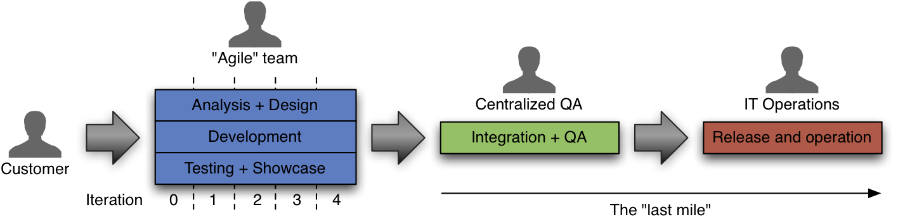
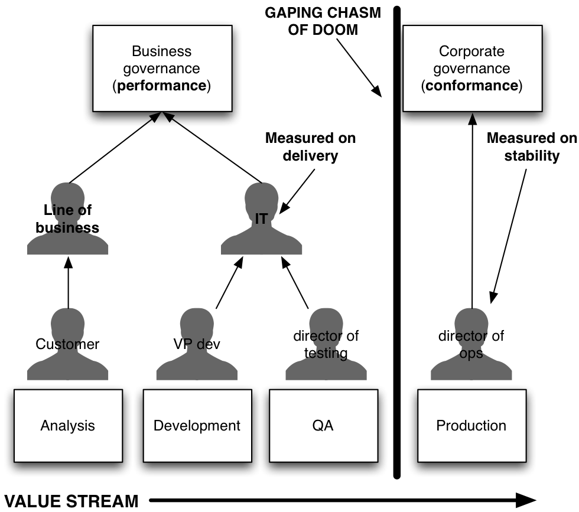
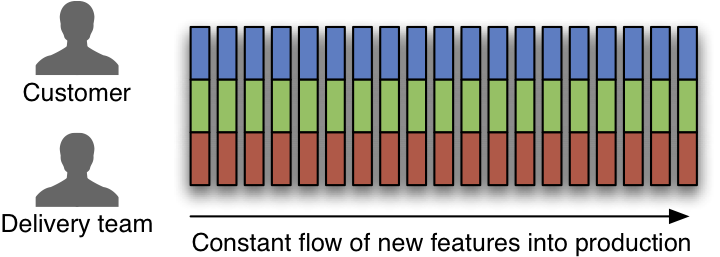
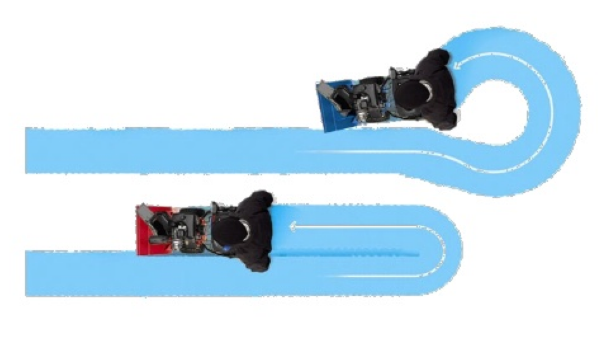

!SLIDE new-chapter center

# What is  <i>DevOps</i>?

!SLIDE

# What Devs think about Ops

...too slow!

!SLIDE

# What Ops think about Devs

They destroy everything!

!SLIDE

# What Management thinks about Devs & Ops

!SLIDE

# What the Client thinks about your company

!SLIDE

# <b>DevOps</b>
# <b>Dev</b>elopers and <b>Op</b>eration<b>s</b> working together

!SLIDE

# <b>DevOps is a Mindset</b>
# <b>not a job title</b>

!SLIDE

# Devs & Ops work together

!SLIDE incremental

# DevOps Best Practices

* Regular Visits / Walk&Talk / Lunch
* Pairing Culture / Force-To-Pair
* QA + Ops as part of the team
* Infrastructure As Code

!SLIDE

# Share Big Picture

!SLIDE new-chapter center

# What is  <i>Continuous Delivery</i>?

!SLIDE

# The capability to reliably release  software to production on demand
# &nbsp;

!SLIDE

# The capability to reliably release  software to production on demand
# **with confidence**

!SLIDE

# Release without Continuous Delivery

The 'last mile' is not agile

!SLIDE

!SLIDE

# Release with Continuous Delivery

Everybody is aligned and agile

!SLIDE

# Faster Turnaround-Times

!SLIDE incremental

# Continuous Delivery

* Software always production ready
* Releases tied to business needs, not operational constraints

!SLIDE incremental

# Benefits for the Business

* Validate business plan, faster earlier
* Costs are more predictable
* Can respond to market demands

!SLIDE incremental

# Benefits for IT

* Less risk per release
* Predictable infrastructure
* Feedback on development process

!SLIDE incremental

# Culture Change

## everybody is responsible for delivery (devs, testers, dbas, ops)
### this is much easier when there is a DevOps mindset

!SLIDE

# You can not change *culture*, but you can change *behavior*
## and behavior gets culture
## &nbsp;
## @damonedwards, DevOpsDays Rome

!SLIDE incremental

# 80% culture challenges
# 20% technical challenges

!SLIDE

"We don't optimize for being right, we optimize for detecting when we're wrong"
  <small style="font-size:.6em">– [Mike Brittain](https://twitter.com/0x604/status/344128876781379584), Etsy</small>

