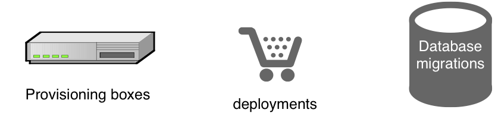
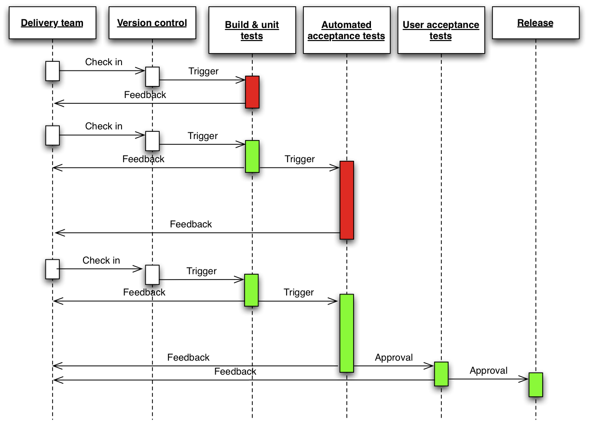
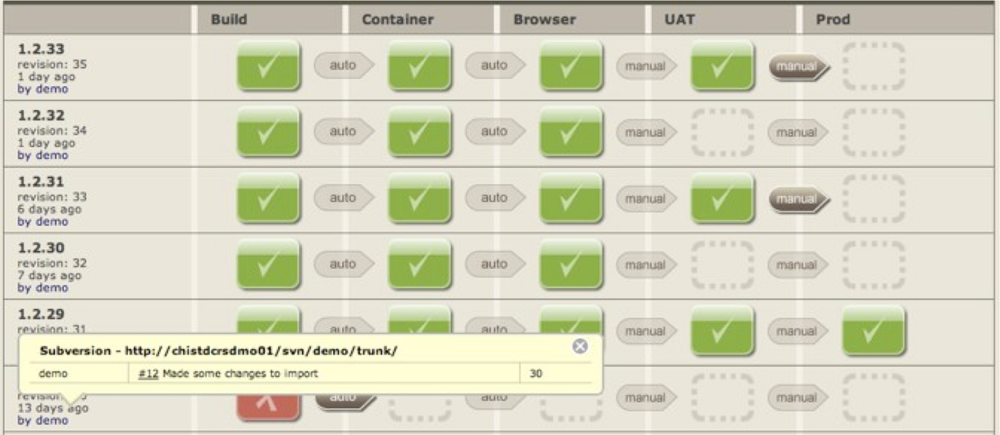

!SLIDE new-chapter

# Principles

!SLIDE

# Principles

create a repeatable, reliable process for releasing software

!SLIDE

# Automate Release Process

!SLIDE incremental

# Deployment Pipeline

Automate build, deploy, test, release process

!SLIDE

# Benefits of Deployment Pipeline

* visibility
* feedback
* control

!SLIDE incremental

# Principles

* keep everything in version control
* if it hurts, do it more often, and bring the pain forward
* build quality in

!SLIDE incremental

# Principles

* Automate almost everything
* build, deploy, test, release
* Use humans for decicions & creative tasks
* manual testing, approvals

!SLIDE

# Principles

## 改善

* [Kaizen](http://en.wikipedia.org/wiki/Kaizen) (= "good change")
* continuous improvement
