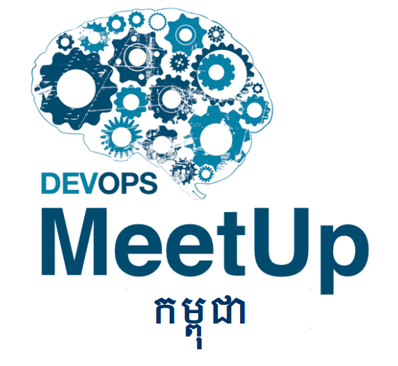
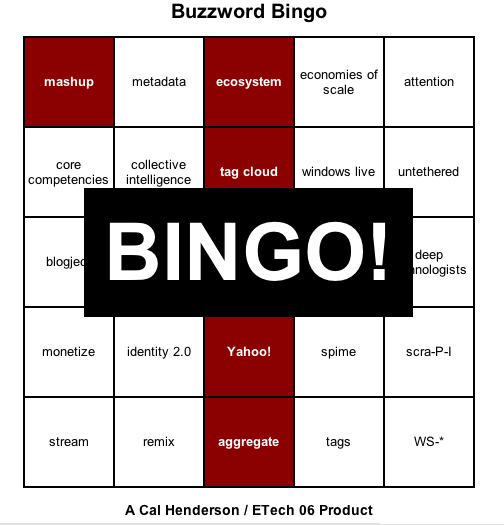

!SLIDE

!SLIDE

# DevOps & Continuous Delivery
## [@ctrabold](http://twitter.com/ctrabold), Christian Trabold  
## DevOpsMeetup Phnom Penh, December 19 2014

!SLIDE smaller

# Me

* ThoughtWorks Consultant Alumnus
* Lover of Open Source 
* Author for O'Reilly

!SLIDE new-chapter center

<small style="font-size:.6em">https://www.flickr.com/photos/ryansking/148659962/</small>

!SLIDE new-chapter center

# Who are you?

!SLIDE

* How big is your organization?
* How often do you release to users?
* What languages do you deploy?

!SLIDE

# Who knows the agile manifesto?

http://agilemanifesto.org/

!SLIDE subsection

# Manifesto for   Agile Software Development
## Our highest priority is to satisfy the customer  
through early and continuous delivery
  of valuable software.
